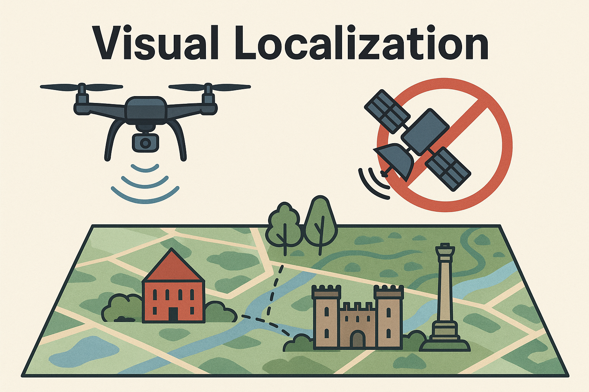

# Visual Drone-Map Localization

Visual localization pipeline for drones operating in GNSS-denied environments. 

Forked from [LightGlue](https://github.com/cvg/LightGlue). Our contributions adapt the core LightGlue matching framework to predict a drone’s position within a larger aerial map based purely on visual features.

<!-- Image -->

  

## Repository Structure

- ``finetune.py``  
  Experimental script for fine-tuning.

- ``lightglue-exp.ipynb`` 
  Jupyter notebook documenting our experiments:
  - Load pretrained SuperPoint and LightGlue weights
  - matching between drone images and map tiles
  - predict position and evaluate

- **(All other files)**  
  Sourced directly from the original [LightGlue](https://github.com/cvg/LightGlue) repository.  

## Visual Drone-Map Localization Pipeline

1. SuperPoint: Extract keypoints and descriptors from drone image + map.
2. LightGlue: Match keypoints between drone image and map window.
    - Improve matching with:
      - Rotation of drone image
      - Sliding window across map (to account for scale differences)
3. Position Prediction: 
    - Select best matching windows (Optionally combine multiple windows)
    - Determine center of matched keypoints
    - Apply similarity transformation to estimate drone position on map

## Usage Notes

* Our experiments assume each drone image is roughly aligned in scale with a zoomed-in map tile. If your scale factor differs, adjust the sliding-window and rotation settings in the notebook.
